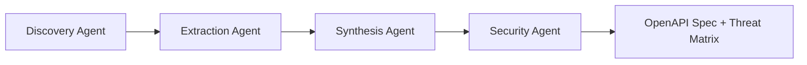

# AI-Powered API Security Audit Directive

**Objective:** Leverage AI agents and OSS security tools to comprehensively discover, document, and assess the security of all API endpoints—both inbound (served) and outbound (consumed)—within a cloned GitHub repository. Produce a complete OpenAPI v3 specification and a vulnerability threat matrix.

**Target Audience:** Security Engineers performing proactive API security audits.

---

## Multi-Agent Architecture

This directive employs four specialized AI agents working in sequence:



| Agent | Purpose | Primary Tools |
|-------|---------|---------------|
| **Discovery** | Framework fingerprinting, dependency analysis | grep, jq, file analysis |
| **Extraction** | Endpoint extraction, route mapping | Semgrep, AST parsing |
| **Synthesis** | OpenAPI specification generation | AI + schema inference |
| **Security** | Vulnerability mapping, threat assessment | Semgrep, Nuclei, Gitleaks |

---

## Phase 1: Discovery Agent (Framework Fingerprinting)

### 1.1 Dependency Analysis
Analyze dependency manifests to identify HTTP client/server libraries:

```bash
# Python
cat requirements.txt pyproject.toml 2>/dev/null | grep -iE "(flask|fastapi|django|requests|httpx|aiohttp|starlette)"

# JavaScript/TypeScript
cat package.json 2>/dev/null | jq -r '.dependencies + .devDependencies | keys[]' | grep -iE "(express|koa|hapi|fastify|axios|fetch|got)"

# Java
cat pom.xml build.gradle 2>/dev/null | grep -iE "(spring-web|jersey|jax-rs|okhttp|retrofit)"

# Go
cat go.mod 2>/dev/null | grep -iE "(gin|echo|fiber|chi|net/http|resty)"
```

### 1.2 Configuration Analysis
Extract API configuration from environment and config files:

```bash
# Search for API base URLs and service endpoints
grep -rn --include="*.env*" --include="*.yaml" --include="*.json" --include="*.py" --include="*.js" \
    -E "(API_URL|BASE_URL|SERVICE_HOST|ENDPOINT|api\..*\.com)" .

# Find existing OpenAPI/Swagger specs
find . -name "openapi.*" -o -name "swagger.*" -o -name "*api-spec*"
```

### 1.3 Framework Detection Output
Generate a service fingerprint JSON:

```json
{
  "framework": "fastapi",
  "language": "python",
  "http_clients": ["httpx", "requests"],
  "api_specs_found": ["docs/openapi.yaml"],
  "config_sources": [".env", "config/settings.py"]
}
```

---

## Phase 2: Extraction Agent (Endpoint Discovery)

### 2.1 Inbound Endpoints (Served APIs)

Use Semgrep with framework-specific rules to extract route definitions:

```bash
# Run with custom API endpoint rules
semgrep scan --config=/app/semgrep-rules/api-endpoints.yaml \
    --json --output=api_endpoints.json .
```

**Semgrep Rule Patterns by Framework:**

| Framework | Pattern | Example |
|-----------|---------|---------|
| FastAPI | `@app.get($PATH)`, `@router.post($PATH)` | `@app.get("/users/{id}")` |
| Flask | `@app.route($PATH, methods=[$METHODS])` | `@app.route("/api/v1/users")` |
| Express | `app.get($PATH, ...)`, `router.post($PATH, ...)` | `app.get('/users/:id', handler)` |
| Spring | `@GetMapping($PATH)`, `@RequestMapping(...)` | `@PostMapping("/api/users")` |
| Go Gin | `r.GET($PATH, ...)`, `r.POST($PATH, ...)` | `r.GET("/users/:id", getUser)` |

### 2.2 Outbound Endpoints (Consumed APIs)

Extract external API calls using Semgrep taint analysis:

```bash
# Detect outbound HTTP requests and trace URL sources
semgrep scan --config=p/trailofbits \
    --config=/app/semgrep-rules/api-outbound.yaml \
    --json --output=outbound_calls.json .
```

**Target Patterns:**
- `requests.get($URL)`, `requests.post($URL, ...)`
- `axios.get($URL)`, `fetch($URL)`
- `http.NewRequest("GET", $URL, ...)`
- `httpx.AsyncClient().get($URL)`

### 2.3 Authentication Vector Mapping

For each endpoint, identify authentication mechanisms:

```bash
# Search for auth headers in code
semgrep scan --config=/app/semgrep-rules/api-auth.yaml \
    --json --output=auth_vectors.json .
```

**Auth Patterns to Detect:**
- `Authorization: Bearer ...`
- `X-API-Key: ...`
- `Basic Auth` (base64 encoded)
- Cookie/Session-based auth
- OAuth2 flows

---

## Phase 3: Synthesis Agent (OpenAPI Generation)

### 3.1 AI-Powered Schema Inference

The Synthesis Agent uses AI to analyze extracted endpoints and generate an OpenAPI v3 specification:

**AI Prompt Template:**
```
You are an API documentation expert. Given the following extracted endpoint data:

INBOUND ENDPOINTS:
{inbound_endpoints_json}

OUTBOUND ENDPOINTS:
{outbound_endpoints_json}

AUTH VECTORS:
{auth_vectors_json}

Generate a complete OpenAPI 3.0.3 specification in YAML format that includes:
1. All inbound endpoints with paths, methods, parameters, and request/response schemas
2. Security schemes based on detected authentication patterns
3. Server URLs from configuration analysis
4. Component schemas inferred from code context

Output ONLY the OpenAPI YAML, no additional commentary.
```

### 3.2 OpenAPI Validation

```bash
# Validate generated spec
npm install -g @apidevtools/swagger-cli
swagger-cli validate openapi-generated.yaml
```

### 3.3 Output Format

```yaml
openapi: "3.0.3"
info:
  title: "[Repository Name] API"
  version: "1.0.0"
  description: "Auto-generated from source code analysis"
servers:
  - url: "https://api.example.com/v1"
paths:
  /users/{id}:
    get:
      summary: "Get user by ID"
      parameters:
        - name: id
          in: path
          required: true
          schema:
            type: string
      responses:
        '200':
          description: "Successful response"
security:
  - bearerAuth: []
components:
  securitySchemes:
    bearerAuth:
      type: http
      scheme: bearer
```

---

## Phase 4: Security Agent (Vulnerability Assessment)

### 4.1 Credential Discovery (CRITICAL)

**Mandatory deep scan of Git history:**

```bash
# Gitleaks full history scan
gitleaks detect --source=. --report-format=json --report-path=gitleaks.json

# TruffleHog deep scan
trufflehog git file://. --json > trufflehog.json
```

**Classification:**
| Finding Type | Risk Level | Action |
|--------------|------------|--------|
| Production API keys (`sk_live_`, `AKIA`) | **CRITICAL** | Immediate revocation |
| Test/staging keys | HIGH | Rotate within 24h |
| Internal service tokens | MEDIUM | Assess exposure |

### 4.2 OWASP API Top 10 Mapping

For each discovered endpoint, assess vulnerability to:

| OWASP ID | Vulnerability | Detection Method |
|----------|---------------|------------------|
| API1:2023 | Broken Object Level Authorization | Semgrep: missing authz checks on `{id}` params |
| API2:2023 | Broken Authentication | Missing/weak auth on endpoints |
| API3:2023 | Broken Object Property Level Auth | Mass assignment patterns |
| API4:2023 | Unrestricted Resource Consumption | Missing rate limiting |
| API5:2023 | Broken Function Level Authorization | Admin endpoints without RBAC |
| API6:2023 | Unrestricted Access to Sensitive Flows | Unprotected business logic |
| API7:2023 | Server Side Request Forgery | User-controlled URLs in requests |
| API8:2023 | Security Misconfiguration | CORS, headers, debug mode |
| API9:2023 | Improper Inventory Management | Undocumented/shadow APIs |
| API10:2023 | Unsafe Consumption of APIs | Untrusted outbound API data |

### 4.3 Endpoint-Specific Scanning

```bash
# Nuclei API vulnerability templates
nuclei -t ~/nuclei-templates/http/vulnerabilities/ \
    -l discovered_endpoints.txt \
    -json -o nuclei_api.json
```

### 4.4 Threat Matrix Output

Generate an API Threat Matrix mapping endpoints to vulnerabilities:

```json
{
  "threat_matrix": [
    {
      "endpoint": "GET /users/{id}",
      "vulnerabilities": [
        {"owasp_id": "API1:2023", "title": "Missing IDOR protection", "severity": "HIGH"},
        {"owasp_id": "API2:2023", "title": "No authentication required", "severity": "CRITICAL"}
      ],
      "credentials_exposed": [],
      "risk_score": 9.2
    }
  ]
}
```

---

## Execution Commands

### Full Automated Scan

```bash
# Using the API audit scanner
python execution/scan_api.py \
    --path /path/to/repo \
    --name repo-name \
    --output /app/vulnerability_reports/repo-name \
    --generate-openapi \
    --threat-matrix
```

### Individual Phase Execution

```bash
# Phase 1: Discovery
python execution/scan_api.py --path . --phase discovery

# Phase 2: Extraction  
python execution/scan_api.py --path . --phase extraction

# Phase 3: Synthesis (requires AI)
python execution/scan_api.py --path . --phase synthesis --ai-provider openai

# Phase 4: Security
python execution/scan_api.py --path . --phase security
```

---

## Deliverables

| Artifact | Format | Description |
|----------|--------|-------------|
| `{repo}_openapi.yaml` | OpenAPI 3.0.3 | Complete API specification |
| `{repo}_api_endpoints.json` | JSON | All discovered endpoints |
| `{repo}_threat_matrix.json` | JSON | OWASP vulnerability mapping |
| `{repo}_api_audit.md` | Markdown | Human-readable summary report |
| `{repo}_credentials.json` | JSON | Credential exposure by endpoint |

---

## Constraints

1. **Secrets vs. Usage Separation**: Phase 2 (credentials) and Phase 3 (endpoints) must remain distinct but cross-referenced
2. **AI Cost Control**: Synthesis Agent budget capped at $0.50 per repository
3. **False Positive Filtering**: Use confidence scores and require manual review for MEDIUM confidence findings
4. **Git History Depth**: Secrets scanning MUST include full Git history, not just HEAD
